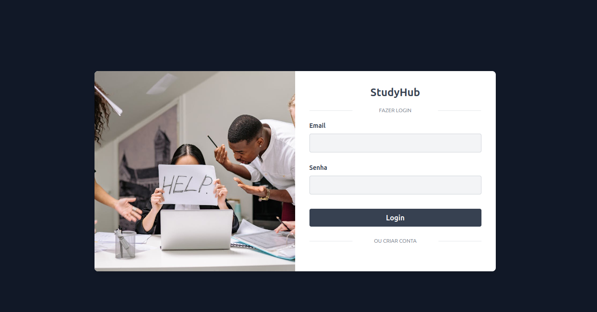
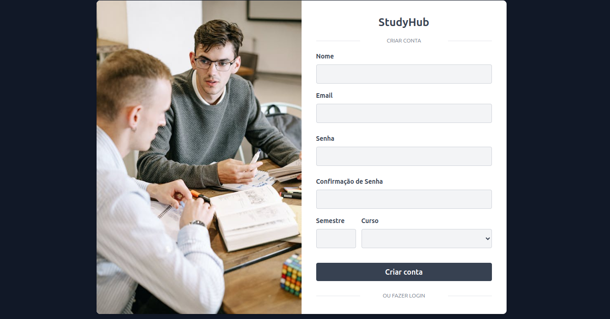
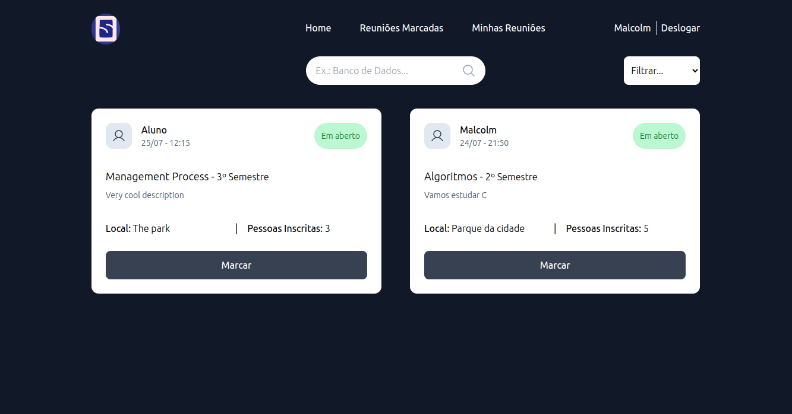
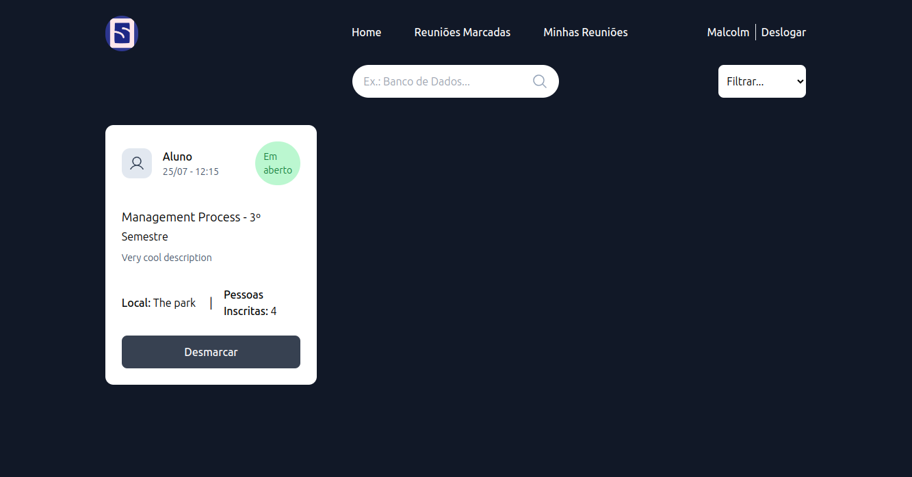
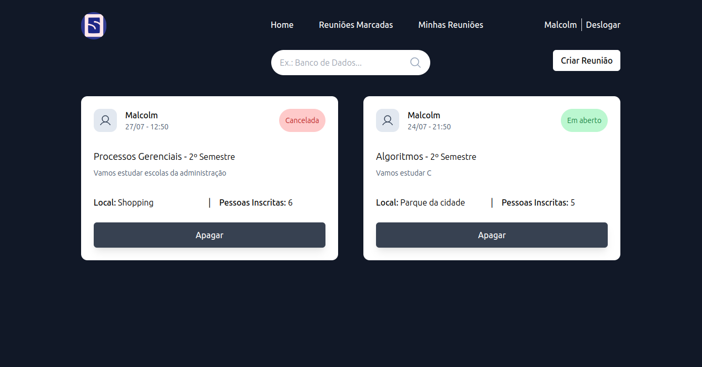

<h1>Grupo De Estudos</h1>

<h2>Sobre</h2>

 Aplicação para criação e agendamento de grupos de estudos para alunos da Fatec e Etec.  

***OBS: O projeto foi feito para fins de estudos, e atualmente está hospedado em um servidor gratuito e limitado da plataforma Render. Portanto, pode ser necessário uma espera de alguns minutos até que as requisições passem a ser respondidas em caso de uma inatividade muito longa.

### Funcionalidades
- [x] Login com uso de sessões otimizadas armazenadas utilizando Redis
- [X] Docker com imagem SQL e com função de volume para evitar perca de dados
- [x] Criação de conta para alunos de mais de 8 cursos
- [x] Visualização de reuniões em aberto
- [X] Criar grupo de estudos
- [X] Confirmar presença em um grupo de estudos
- [X] Cancelar presença
- [X] Cancelar grupo de estudos
- [X] Filtro por título, descrição e data
- [X] Testes Unitários
- [X] Inversão e Injeção de Dependências 
- [X] Responsivo

<h1>
    
</h1>

<h1>
    
</h1>

<h1>
    
</h1>

<h1>
    
</h1>

<h1>
    
</h1>

### Tecnologias
- NestJS
- Docker
- MySQL
- Redis
- Passport
- Prisma
- Swagger
- React
- Typescript
- Axios
- Tailwind
- React-Router
- Hooks

---

Made with ❤️ by Malcolm Mello - [LinkedIn](https://www.linkedin.com/in/malcolm-lima/) - and Gabriel Santos - [LinkedIn](https://www.linkedin.com/in/gabriel-santos-0aa008215/) 